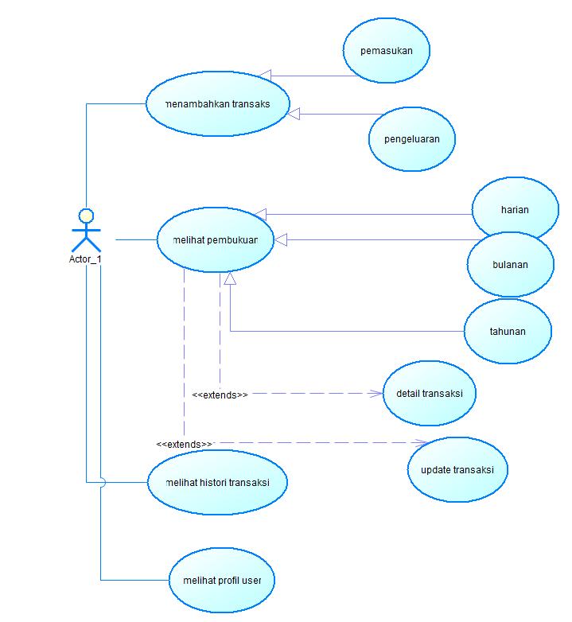
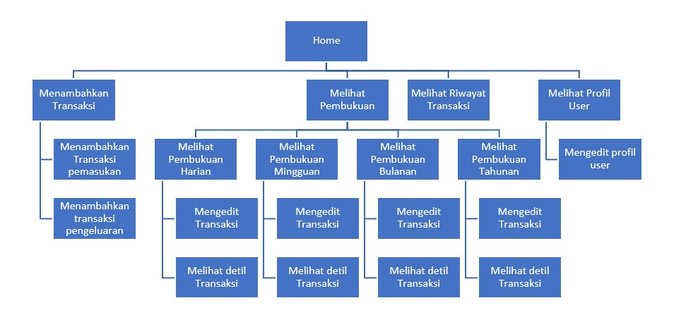
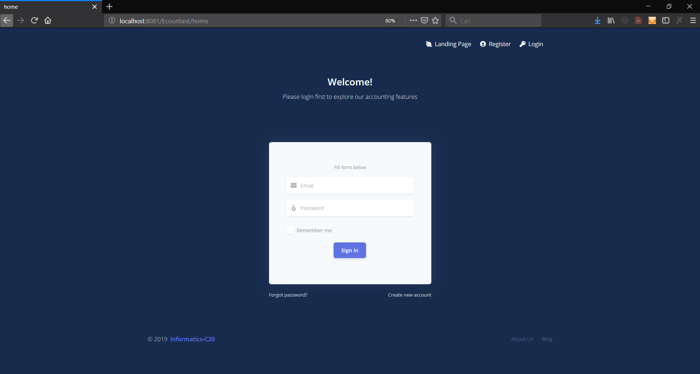
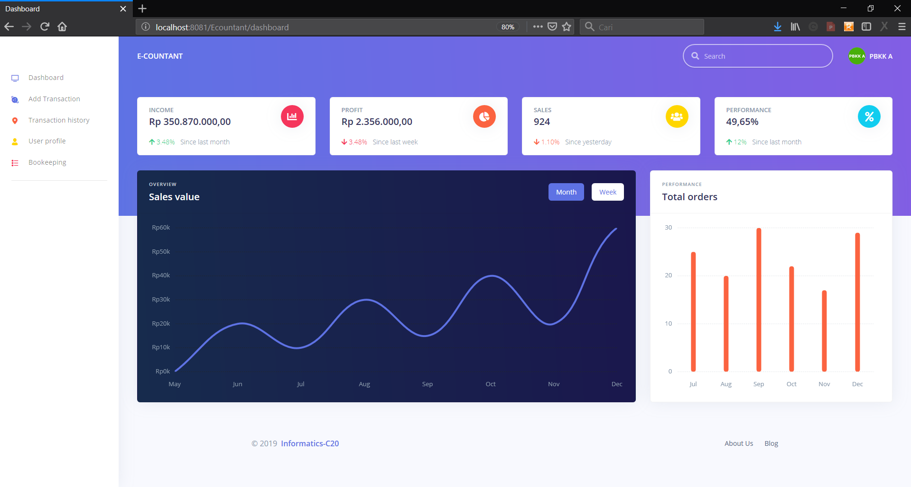
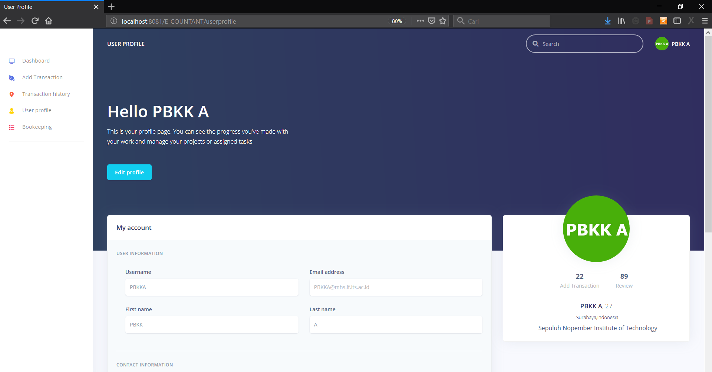
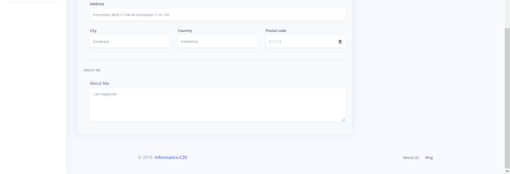

# FP_PBKK

## Nama Aplikasi :
  E-Countant

## Anggota Kelompok :
- Dimas Kamurapi    05111640000002
- Denny Rengganis   05111640000099
- Magdalane Andin   05111640000112

## Deskripsi :
E-Countant adalah aplikasi pembukuan/akuntasi yang dapat menyimpan data pemasukan dan pengeluaran yang akan direkap secara langsung menjadi bentuk buku besar,bulanan hingga buku tahun. Pengguna hanya menginputkan data tersebut sekali saja dan sistem otomatis membuatkan rekapan dalam bentuk pembukuan lainnya.
    

## 1 . Use Case :
File Use Case diagram yang telah dibuat ada pada folder use case.
Berikut gambar dari use case diagram yang dibuat:

## 2. Site Map:
site map yang dibuat berada pada folder  sitemap.
Berikut gambar dari sitemap yang dibuat:

## 3. Tampilan Web
Spring Code project nya berada pada folder E-COUNTANT.
Untuk contoh tampilan web sebagai berikut:

### a. Tampilan login page

### b. Tampilan Dasboarad (after login)

### c. Tampilan User Profile

